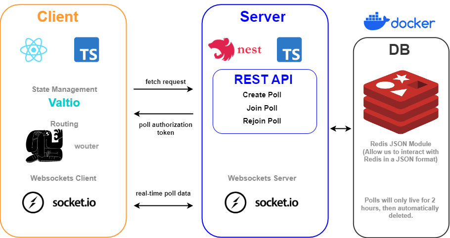

<!-- Improved compatibility of back to top link: See: https://github.com/othneildrew/Best-README-Template/pull/73 -->
<a name="readme-top"></a>

[![Contributors][contributors-shield]][contributors-url]
[![Forks][forks-shield]][forks-url]
[![Stargazers][stars-shield]][stars-url]
[![Issues][issues-shield]][issues-url]
[![MIT License][license-shield]][license-url]
[![LinkedIn][linkedin-shield]][linkedin-url]


<!-- PROJECT LOGO -->
<br />
<div align="center">
  <a href="https://github.com/Prasenjit-3433/Rankr">
    
  </a>

<h3 align="center">Rankr</h3>

  <p align="center">
    A Real-Time Ranked Based Choice Voting App
    <br />
    <a href="https://github.com/Prasenjit-3433/Rankr"><strong>Explore the docs »</strong></a>
    <br />
    <br />
    <a href="">View Demo</a>
    ·
    <a href="https://github.com/Prasenjit-3433/Rankr/issues">Report Bug</a>
    ·
    <a href="https://github.com/Prasenjit-3433/Rankr/issues">Request Feature</a>
  </p>
</div>


<!-- TABLE OF CONTENTS -->
<details>
  <summary>Table of Contents</summary>
  <ol>
    <li>
      <a href="#about-the-project">About The Project</a>
      <ul>
        <li><a href="#built-with">Tech Stack</a></li>
      </ul>
    </li>
    <li>
      <a href="#getting-started">Running the application</a>
      <ul>
        <li><a href="#prerequisites">Prerequisites</a></li>
        <li><a href="#installation">Installation</a></li>
      </ul>
    </li>
    <li><a href="#implementation">Implementation</a></li>
    <li><a href="#contributing">Contributing</a></li>
    <li><a href="#license">License</a></li>
    <li><a href="#contact">Contact</a></li>
    <li><a href="#acknowledgments">Acknowledgments</a></li>
  </ol>
</details>


<!-- ABOUT THE PROJECT -->
## 🙋 About The Project

<!--   -->
<p align="center">
  
</p>


Introducing Ranker, the ultimate solution for making quick decisions among friends and indecisive groups! Ranker is not just your average voting app; it's a cutting-edge, real-time decision-making tool designed to streamline the process of ranking choices and gathering immediate feedback from all connected participants.

With Ranker, you can harness the power of real-time synchronization, ensuring that the data is instantly updated across all connected front-end client applications. Gone are the days of waiting for results or struggling to reach a consensus—Ranker makes the decision-making process seamless, efficient, and, most importantly, fun!

Whether you're trying to choose a restaurant for dinner, select a movie for movie night, or make any other group decision, Ranker empowers you to create ranked choice votes effortlessly. Simply create a vote, invite your friends or collaborators, and watch as the rankings evolve in real-time, giving you a clear view of everyone's preferences.

<p align="right">(<a href="#readme-top">back to top</a>)</p>


### 🛠 Built With

* 
* 
* 
* 
* 
* 
* 
* 


<p align="right">(<a href="#readme-top">back to top</a>)</p>


<!-- GETTING STARTED -->
## 🚀 Running the application

In order to run the application, you will need to have some prerequisite tools installed. 

### Prerequisites

First, you'll need to be able to run `docker-compose` command. If you are able to install Docker with Docker Desktop, that is probably the easiest solution.

Second, you'll need NodeJS for both the client and server applications. I recommend you use [nvm](https://github.com/nvm-sh/nvm) or [nvm-windows](https://github.com/coreybutler/nvm-windows) and make sure to use the same version of node found in the [.nvmrc](/.nvmrc) file at the root of the project. You can run `nvm use` from the root of the project to make sure you're using the same version of node as me. 

With the everything installed and with Docker running on your machine, you can launch a docker container running `redis-json`, the backend Nest JS application, and the front-end react application by running the following from the root of the project.


### Installation

```sh
npm run start
```

The project root's `package.json` file and its npm scripts are basically just for convenience of running all applications and a database at once.

You can also run these applications separately by running the appropriate npm scripts inside of each project's `package.json` file. 


<p align="right">(<a href="#readme-top">back to top</a>)</p>


<!-- Features -->
## 💎 Key Features of Ranker:

- [ ] **Real-Time Synchronization**: Enjoy the benefits of instant data updates as all participants rank their choices simultaneously, ensuring that everyone's input is accounted for immediately.
- [ ] **Effortless Decision-Making**: Say goodbye to endless debates and long discussions. Ranker's intuitive interface simplifies the process of ranking choices, making it quick and easy to reach a decision.
- [ ] **Customizable Voting**: Tailor your votes to suit your specific needs, whether it's selecting multiple options, setting a time limit, or allowing participants to add their own choices.
- [ ] **Invite and Collaborate**: Invite your friends, family, or colleagues to join your vote, allowing for group collaboration no matter where everyone is located.
- [ ] **User-Friendly Interface**: Ranker boasts an elegant and user-friendly design that ensures a smooth and enjoyable decision-making experience.

No more indecision, no more waiting—Ranker is your go-to app for fast and efficient decision-making. Download Ranker today and revolutionize the way you and your friends make choices!

See the [open issues](https://github.com/Prasenjit-3433/Rankr/issues) for a full list of proposed features (and known issues).

<p align="right">(<a href="#readme-top">back to top</a>)</p>


<!-- CONTRIBUTING -->
## 🤝 Contributing

Contributions are what make the open source community such an amazing place to learn, inspire, and create. Any contributions you make are **greatly appreciated**.

If you have a suggestion that would make this better, please fork the repo and create a pull request. You can also simply open an issue with the tag "enhancement".
Don't forget to give the project a star! Thanks again!

1. Fork the Project
2. Create your Feature Branch (`git checkout -b feature/AmazingFeature`)
3. Commit your Changes (`git commit -m 'Add some AmazingFeature'`)
4. Push to the Branch (`git push origin feature/AmazingFeature`)
5. Open a Pull Request

<p align="right">(<a href="#readme-top">back to top</a>)</p>


<!-- LICENSE -->
## 📜 License

Distributed under the MIT License. See `LICENSE.txt` for more information.

<p align="right">(<a href="#readme-top">back to top</a>)</p>


<!-- CONTACT -->
## 📮 Contact

Prasenjit Sutradhar - [@twitter_handle](https://twitter.com/Prasenj13074756) - prasenjitsutradhar3433@gmail.com

Project Link: [https://github.com/Prasenjit-3433/Rankr](https://github.com/Prasenjit-3433/Rankr)

<p align="right">(<a href="#readme-top">back to top</a>)</p>


<!-- ACKNOWLEDGMENTS -->
## ✌️ Acknowledgments

* [Fontawesome](https://fontawesome.com/)
* [Confett.js](https://www.cssscript.com/confetti-falling-animation/)
* [Heropatterns - SVG Background](https://heropatterns.com/)

<p align="right">(<a href="#readme-top">back to top</a>)</p>


<!-- MARKDOWN LINKS & diagrams -->
<!-- https://www.markdownguide.org/basic-syntax/#reference-style-links -->
[contributors-shield]: https://img.shields.io/github/contributors/Prasenjit-3433/Rankr.svg?style=for-the-badge
[contributors-url]: https://github.com/Prasenjit-3433/Rankr/graphs/contributors
[forks-shield]: https://img.shields.io/github/forks/Prasenjit-3433/Rankr.svg?style=for-the-badge
[forks-url]: https://github.com/Prasenjit-3433/Rankr/network/members
[stars-shield]: https://img.shields.io/github/stars/Prasenjit-3433/Rankr.svg?style=for-the-badge
[stars-url]: https://github.com/Prasenjit-3433/Rankr/stargazers
[issues-shield]: https://img.shields.io/github/issues/Prasenjit-3433/Rankr.svg?style=for-the-badge
[issues-url]: https://github.com/Prasenjit-3433/Rankr/issues
[license-shield]: https://img.shields.io/github/license/Prasenjit-3433/Rankr.svg?style=for-the-badge
[license-url]: https://github.com/Prasenjit-3433/Rankr/blob/main/LICENSE.txt
[linkedin-shield]: https://img.shields.io/badge/-LinkedIn-black.svg?style=for-the-badge&logo=linkedin&colorB=555
[linkedin-url]: https://www.linkedin.com/in/prasenjitsutradhar/
[product-screenshot]: diagrams/screenshot.png
[HTML5]: https://img.shields.io/badge/HTML5-f06529?style=for-the-badge&logo=html5&logoColor=white
[HTML-url]: https://developer.mozilla.org/en-US/docs/Glossary/HTML5
[Css]: https://img.shields.io/badge/CSS3-2965f1?style=for-the-badge&logo=CSS3&logoColor=white
[Css-url]: https://developer.mozilla.org/en-US/docs/Web/CSS
[Js]: https://img.shields.io/badge/JavaScript-F0DB4F?style=for-the-badge&logo=JavaScript&logoColor=323330
[Js-url]: https://www.javascript.com/

